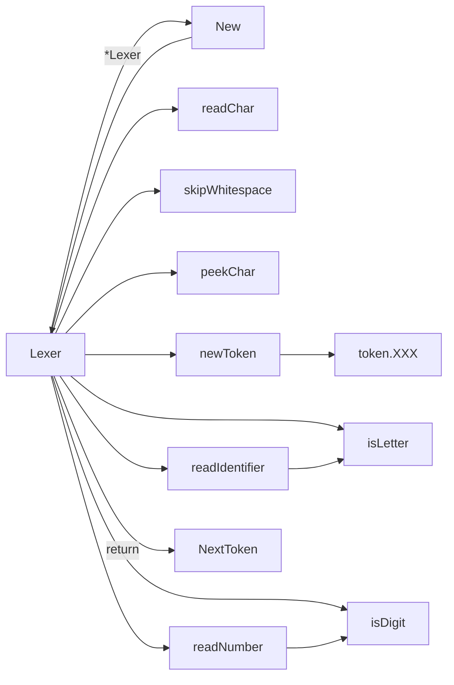

# GoCC

下载代码：
1. https://interpreterbook.com/waiig_code_1.7.zip

## 前言
- 
- 下载代码，安装环境。
- 微信读书可以免费阅读。

## 词法分析

- 将字符转为 token
- lexer 的调用关系

```mermaid
graph LR
Lexer[Lexer] --> New
Lexer --> readChar
Lexer --> skipWhitespace
Lexer --> peekChar
Lexer --> newToken
Lexer --> readIdentifier
Lexer --> isLetter
Lexer --> readNumber
Lexer --> isDigit
Lexer -->|return| NextToken

New[New] -->|*Lexer| Lexer
newToken --> token.XXX
readIdentifier --> isLetter
readNumber --> isDigit
```

